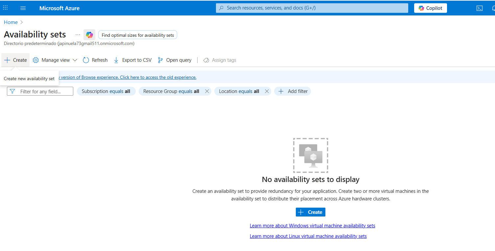
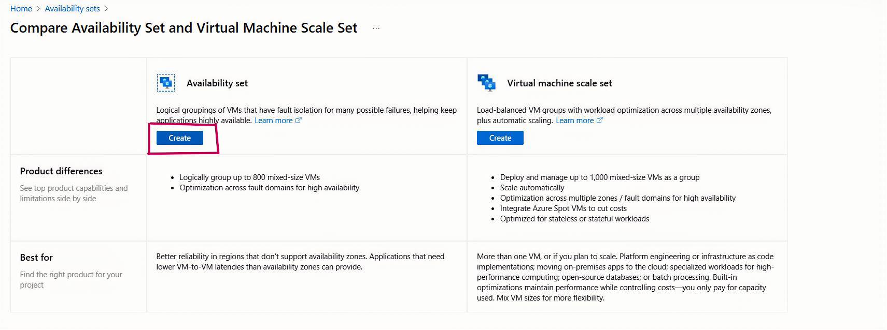
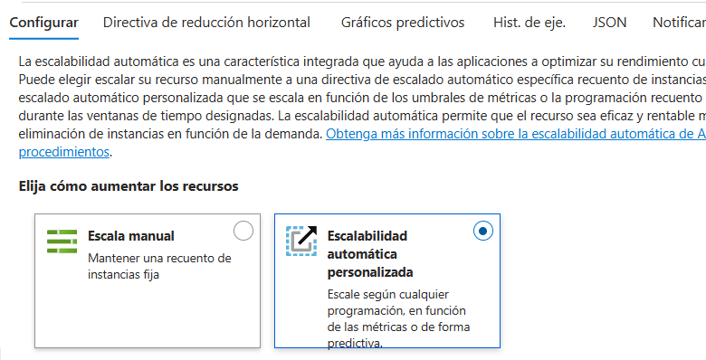
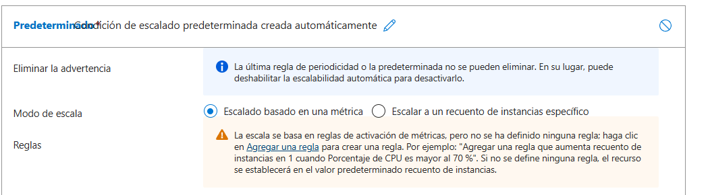
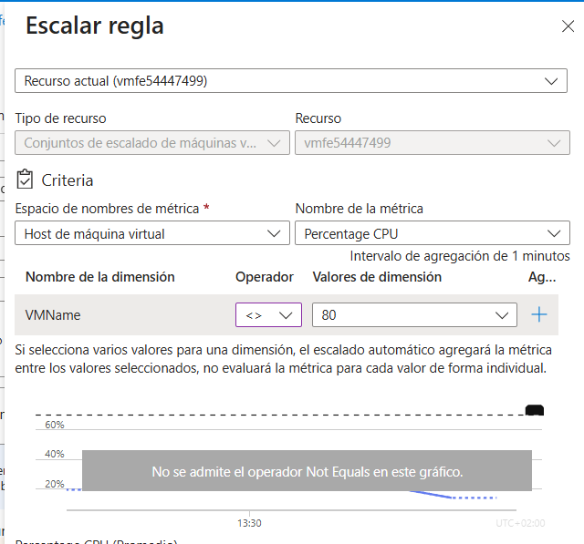
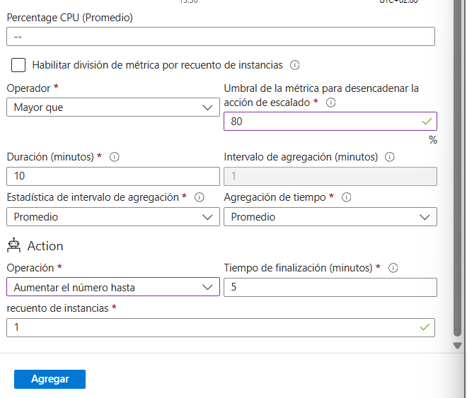

# 🌐 Laboratorios AZ-900 (Microsoft Learn On Demand)

Este repositorio contiene la documentación de los **Labs 10 y 11** realizados como parte de la preparación para el examen **AZ-900: Microsoft Azure Fundamentals**.  

La actividad formó parte de un curso de **Big Data**, donde cada alumno debía documentar dos laboratorios asignados.  
A mí me correspondieron los siguientes:  

- **Lab 10:** Enable High Availability by Using Availability Sets  
- **Lab 11:** Enable Azure Virtual Machine Scale Sets for High Availability and Scalability  

---

## 📘 Lab 10 - Availability Sets & Load Balancer

### Pasos principales
1. Crear un **Availability Set** con su red virtual.  
2. Desplegar **dos máquinas virtuales (VM1 y VM2)** dentro del conjunto.  
3. Configurar un **Azure Load Balancer** para distribuir el tráfico entre las VMs.  

📸 Ejemplo: creación de un Availability Set  

---

## 📘 Lab 11 - Virtual Machine Scale Sets (VMSS)

### Pasos principales
1. Crear un **VM Scale Set** para la capa web, con **autoescalado** configurado.  
2. Implementar un segundo **VM Scale Set (App Tier)** mediante plantilla ARM.  
3. Verificar la conectividad mediante la IP pública y configurar reglas de seguridad de red (NSG).  

📸 Ejemplo: configuración de reglas de autoescalado  

---

## 🛠️ Tecnologías utilizadas
- Microsoft Azure Portal  
- Availability Sets  
- Load Balancer  
- Virtual Machine Scale Sets (VMSS)  
- ARM Templates  

---
